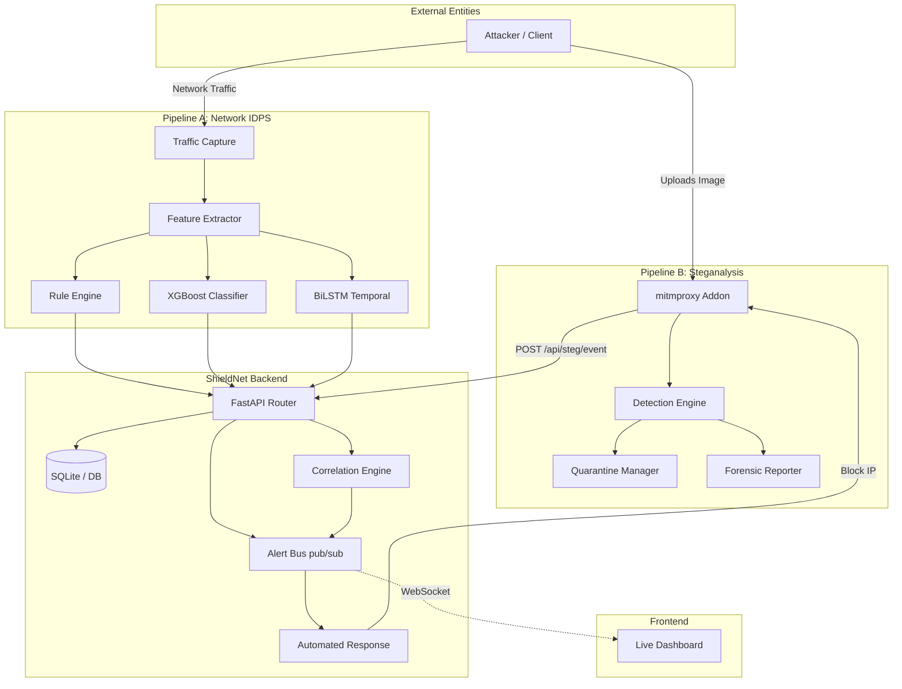
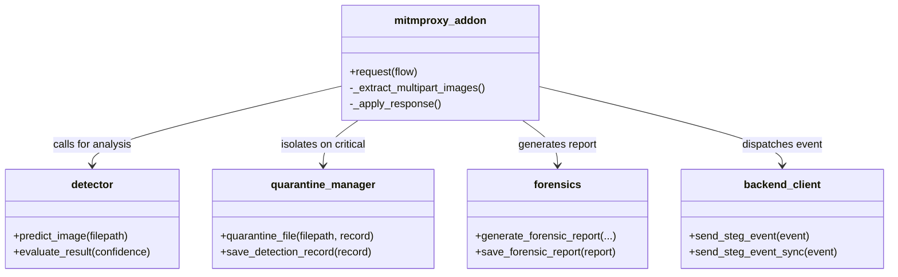
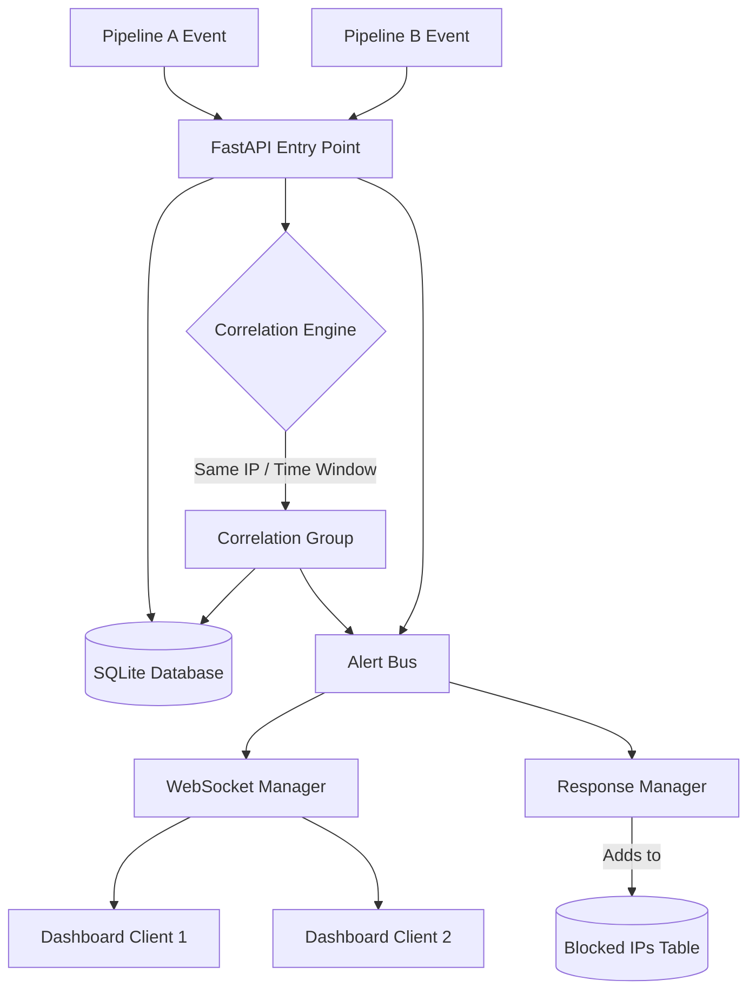
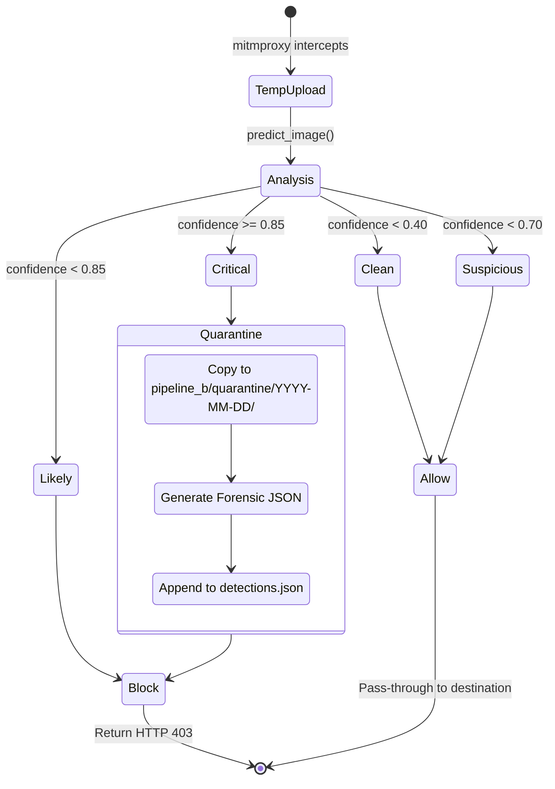

# ShieldNet — System Architecture

This document describes the high-level architecture, module relationships, and data flows of the ShieldNet AI-Powered Intrusion Detection & Prevention System.

---

## 1. High-Level Architecture

ShieldNet is composed of two primary detection pipelines (Pipeline A and Pipeline B), a shared FastAPI backend, a real-time alerting bus, and a live monitoring dashboard. 



---

## 2. Folder Structure

The project is organized into modular directories based on functionality:

```text
ShieldNet-AI-powered-IDPS/
├── backend/                      # Central FastAPI application
│   ├── api/                      # REST endpoints and WebSocket routes
│   │   └── routes/               # Modular routers (steg, idps, dashboard)
│   ├── core/                     # App configuration, logging, exceptions
│   ├── db/                       # SQLAlchemy models, sessions, and schemas
│   └── services/                 # Business logic and coordination
│       ├── correlation/          # Multi-pipeline incident linking
│       ├── honeypot/             # Decoy services management
│       ├── idps/                 # Pipeline A logic (ML, rules, capture)
│       └── response/             # Automated IP blocking and Alert Bus
├── pipeline_b/                   # Pipeline B (Steganalysis Interceptor)
│   ├── detector.py               # ML and Statistical fusion algorithms
│   ├── mitmproxy_addon.py        # Proxy interceptor logic
│   ├── quarantine_manager.py     # Secure file isolation
│   ├── backend_client.py         # Async backend communication
│   ├── forensics.py              # Incident report generation
│   ├── quarantine/               # Secure storage for detected files
│   └── logs/                     # Operational logs and forensic JSONs
├── tests/                        # Automated test suites
│   ├── pipeline_b/               # Pytest suite for Steganalysis
│   └── ...
├── models/                       # Trained ML artifacts (XGBoost, CNN, BiLSTM)
├── data/                         # Datasets (CICIDS2017, etc.)
└── dashboard.html                # Single-page UI for real-time monitoring
```

---

## 3. Pipeline B: Module Relationships

Pipeline B is heavily modularized to decouple proxy interception from heavy ML inference and backend communication.



---

## 4. Data Flow: Steganography Detection (Pipeline B)

This sequence illustrates the end-to-end data flow when an attacker uploads a steganographic image.

```mermaid
sequenceDiagram
    participant Attacker
    participant Proxy as mitmproxy Addon
    participant Det as Detection Engine
    participant Quar as Quarantine Mgr
    participant API as FastAPI Backend
    participant Dash as Dashboard

    Attacker->>Proxy: Upload image (POST)
    Proxy->>Proxy: Intercept & Save temp file
    Proxy->>Det: predict_image()
    
    rect rgb(40, 40, 50)
        Note over Det: 7 Statistical Algorithms<br/>+ EfficientNet-B0
    end
    
    Det-->>Proxy: Result (confidence: 0.93)
    Proxy->>Det: evaluate_result(0.93)
    Det-->>Proxy: Action: quarantine
    
    par Forensic & Isolation
        Proxy->>Quar: quarantine_file()
        Proxy->>Proxy: generate_forensic_report()
    and Alert Generation
        Proxy->>API: POST /api/steg/event
        API->>API: DB Insert (StegScan, Incident)
        API->>Dash: WebSocket Event
    end
    
    Proxy-->>Attacker: HTTP 403 Forbidden
```



---

## 5. Backend Communication & Correlation

When events arrive at the backend (from either Pipeline A or B), they undergo correlation and broad distribution.



---

## 6. Quarantine Workflow

Files flagged as `critical` by the Steganalysis pipeline are immediately isolated.



---

## 7. Future Dashboard Integration

The dashboard receives real-time WebSocket events and updates the UI dynamically. Future enhancements will integrate deep forensic reporting directly into the frontend.

```mermaid
graph LR
    subgraph "Backend"
        WS[WebSocket /api/ws/live]
        API1[GET /api/steg/forensics/{id}]
        API2[GET /api/steg/quarantine]
    end

    subgraph "Dashboard UI"
        Feed[Live Incident Feed]
        HM[Confidence Heatmap]
        FQ[Forensics Modal / Viewer]
        IP[Blocked IP Manager]
    end

    WS -. "JSON Alerts" .-> Feed
    Feed --> HM
    Feed -- "Click Event" --> FQ
    FQ -- "Fetch details" --> API1
    IP -- "Poll" --> API2
```

---
