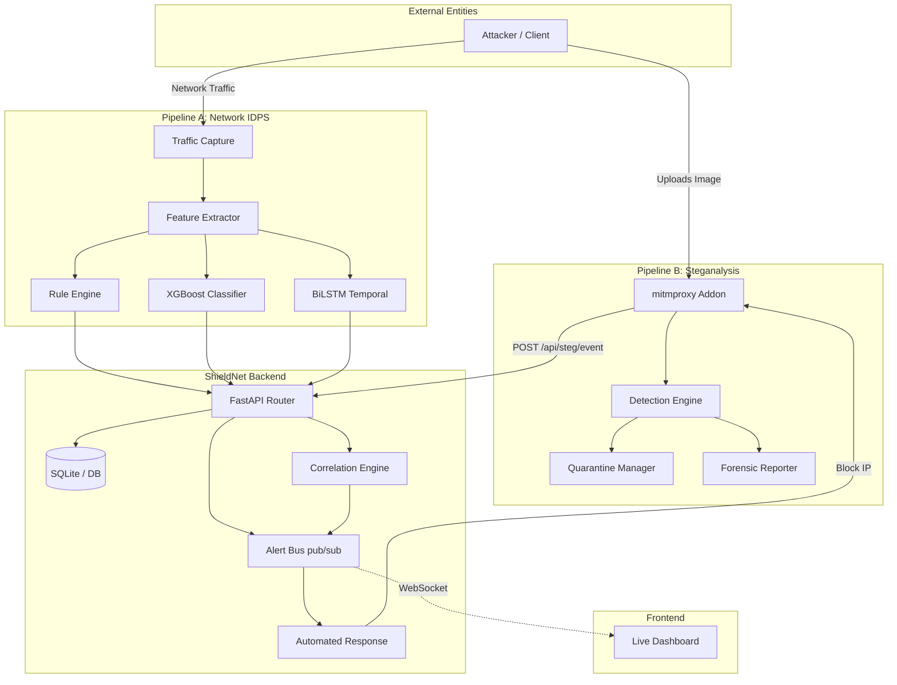

# ShieldNet — AI-Powered Intrusion Detection & Prevention System

> Research-grade cybersecurity platform combining deterministic rules, XGBoost behavioral analysis, and BiLSTM temporal detection into a unified real-time IDPS, coupled with automated steganographic covert channel interception and forensic analysis.

[](https://www.python.org/downloads/)
[](https://fastapi.tiangolo.com/)
[](LICENSE)

---

## Table of Contents

- [What is ShieldNet?](#what-is-shieldnet)
- [Key Features](#key-features)
- [Project Architecture & Multi-Pipeline Design](#project-architecture--multi-pipeline-design)
- [Detailed Feature Breakdown](#detailed-feature-breakdown)
  - [Pipeline A: Network IDPS](#pipeline-a-network-idps)
  - [Pipeline B: Automated Steganography Interception](#pipeline-b-automated-steganography-interception)
  - [Honeypots & Correlation Engine](#honeypots--correlation-engine)
  - [Attacker Simulation & Testing Tools](#attacker-simulation--testing-tools)
- [Project Structure](#project-structure)
- [ML Training Pipeline](#ml-training-pipeline)
- [Prerequisites](#prerequisites)
- [Installation](#installation)
- [Quick Start](#quick-start)
- [How to Run the Project](#how-to-run-the-project)
- [API Documentation](#api-documentation)
- [Demo Guide](#demo-guide)
- [Troubleshooting](#troubleshooting)
- [Tech Stack](#tech-stack)
- [Contributing](#contributing)
- [License](#license)

---

## What is ShieldNet?

ShieldNet is a full-stack, AI-powered cybersecurity platform designed to detect, classify, and respond to network intrusions and covert channel data leaks in real time. By ingesting live or simulated network traffic, ShieldNet routes data through a multi-stage detection funnel (Rules → Classical ML → Sequence Model) and a steganographic inspection proxy, streaming live alerts to a centralized monitoring dashboard via WebSockets.

---

## Key Features

- **Three-Stage Detection Funnel**: Combines low-latency deterministic rules, high-accuracy XGBoost behavioral analysis, and temporal BiLSTM sequence analysis.
- **Real-Time Monitoring**: Single-page live dashboard with real-time WebSocket event streaming.
- **Automated Incident Response**: Instant IP blocking, quarantine of infected files, and watchlist management.
- **Explainable AI (XAI)**: SHAP-based model justification (TreeExplainer and KernelExplainer) outputting human-readable forensic reasons.
- **Covert Channel Steganalysis**: Transparent HTTP/HTTPS upload interception via mitmproxy, applying a hybrid of 7 statistical checks and an EfficientNet-B0 CNN.
- **Event Correlation**: Grouping related network events and steganography detections from the same source IP/timeframe.
- **Attack Simulation Suite**: Built-in CLI tools to simulate DDoS, Brute Force, Port Scans, SQL Injection, and LSB image steganography.
- **Cross-Dataset Foundation**: Models trained on CICIDS2017, IDS2018, and UNSW-NB15 datasets.

---

## Project Architecture & Multi-Pipeline Design



---

## Detailed Feature Breakdown

### Pipeline A: Network IDPS

Pipeline A captures, processes, and classifies network traffic packets using a combination of fast heuristics and deep neural networks.

1. **Traffic Ingestion & Normalization**:
   - Captures packets using `Scapy` (or reads from PCAP files).
   - Aggregates packets into bidirectional network flows based on a 5-tuple key: `(Src IP, Dst IP, Src Port, Dst Port, Protocol)`.
   - Extracts over 42 statistical flow features (e.g., flow duration, forward/backward packet rates, mean/std of Inter-Arrival Times (IAT), packet sizes, payload entropy, and destination port types).

2. **Stage 1: Heuristic Engine (Deterministic Rules)**:
   Fast, low-latency matching of exactly 7 signature-based rules:
   - *Vertical Port Sweep*: Over 30 unique ports targeted from a single IP within 60 seconds (MITRE T1046 - Discovery).
   - *SYN Flood*: Over 200 SYN packets captured without matching ACKs (MITRE T1498 - DDoS).
   - *Excessive Auth Attempts*: Over 15 connection attempts to secure/auth ports (22, 3389, 21, 23) in a window (MITRE T1110 - Brute Force).
   - *Extreme Packet Rate (PPS)*: Flow exceeding 1,500 Packets Per Second (MITRE T1499 - Endpoint DoS).
   - *SQL Injection*: Signature patterns matching common SQL injection keywords in packet payloads (MITRE T1190 - Web Exploit).
   - *Oversized Packet*: Packet size exceeding 1,500 bytes (potential jumbo probe).
   - *Abnormally Small Packet Header*: Packet size less than 20 bytes (potential obfuscation).

3. **Stage 2: Behavioral ML Engine (XGBoost)**:
   - Evaluates flows that bypass Stage 1 rules.
   - An XGBoost classifier trained on 2.8M+ CICIDS2017 samples classifies flows into 6 attack types (*Benign*, *Bot*, *DoS*, *Infiltration*, *PortScan*, *Other*).
   - Calibrated with Isotonic Regression and balanced using SMOTE to ensure highly reliable probability scores.

4. **Stage 3: Temporal Sequence Model (BiLSTM + Attention)**:
   - Tracks sequences of flows from each source IP to capture the context of multi-stage attacks (e.g., Scan → Brute Force → Exfiltration).
   - Uses PyTorch-based BiLSTM architecture with self-attention to identify pivot points in temporal attack paths.

5. **Consensus & Automated Response**:
   - The **Fusion Engine** aggregates scores. Agreement across ML models boosts severity to `CRITICAL`.
   - High-risk threats trigger immediate firewall/proxy drop actions (`Blocker.py`).
   - Medium-risk threats place the source IP on a **Watchlist** and mirror its traffic to a decoy Honeypot.

---

### Pipeline B: Automated Steganography Interception

Pipeline B intercepts web traffic, analyzes uploaded images/videos for hidden payloads (covert channels), quarantines files, and outputs forensic reports.

1. **mitmproxy Interception Addon**:
   - Actively intercepts HTTP/HTTPS requests transparently.
   - Extracts uploaded images (PNG, JPG, BMP) from multipart form data or binary payloads.
   
2. **Dual-Engine Fusion Classifier**:
   - **7 Statistical Algorithms**:
     - *Chi-Square Test*: Detects statistical deviance of color frequency.
     - *RS (Regular-Singular) Analysis*: Evaluates pixel-group noise susceptibility.
     - *Sample Pair Analysis*: Measures correlation between adjacent pixel values.
     - *DCT Coefficient Analysis*: Analyzes discrete cosine transform domain anomalies.
     - *Pixel Histogram Analysis*: Inspects irregularities in color palettes.
     - *Noise Residual Analysis*: Checks high-frequency noise deviations.
     - *Benford's Law*: Verifies first-digit probability distribution across pixel/DCT blocks.
   - **CNN Inference Model**:
     - Fuses statistical findings with prediction scores from a fine-tuned EfficientNet-B0 PyTorch model.

3. **Action & Quarantine Engine**:
   - Maps classification confidence to automatic severity responses:
     - `0.00 - 0.40`: **Clean** (Allow request)
     - `0.40 - 0.70`: **Suspicious** (Log, dispatch API alert, allow request)
     - `0.70 - 0.85`: **Likely Steg** (Block request with HTTP 403, dispatch API alert)
     - `0.85 - 1.00`: **Critical Steg** (Block request with HTTP 403, quarantine file, generate full forensics, dispatch API alert)
   - Quarantined files are moved, encrypted, and isolated under `pipeline_b/quarantine/`.
   - Detailed forensic report JSONs are compiled, providing full metrics breakdown, estimated payload bytes, and recommended analyst remedies.

---

### Honeypots & Correlation Engine

- **Honeypot Redirection**: Medium-risk alerts trigger redirection of suspicious traffic to high-interaction honeypots simulating services on secure ports, harvesting attacker credentials, payloads, and mapping them to MITRE ATT&CK techniques.
- **Correlation Engine**: Groups disparate events (e.g., a port scan followed by a stego image upload from the same source IP within a sliding temporal window) into a unified incident report to prevent alert fatigue.

---

### Attacker Simulation & Testing Tools

ShieldNet contains tools designed to demonstrate and validate its intrusion detection capabilities:

1. **`attacker_steg_tool.py`**:
   - A standalone tool providing both a GUI (Tkinter-based) and a CLI to hide secret text inside image LSBs.
   - Attacker uses this to generate the stego files for test uploads.
   
2. **`embed_and_detect.py`**:
   - CLI utility that generates a cover image, embeds a custom text payload, uploads it to the running ShieldNet API endpoint, and checks if it is correctly flagged and extracted.

3. **`attack.py`**:
   - Simulates multi-stage attacks (port scanning, brute force, SQL injection, and DDoS floods) targeting the `attack_proxy.py` to trigger and test IDPS alerts.

---

## Project Structure

```
main_el/
├── backend/                        # FastAPI application core
│   ├── api/                        # REST routes and WebSockets
│   │   └── routes/                 # Routers (steg, idps, dashboard)
│   ├── core/                       # Configurations, logging, and queues
│   ├── db/                         # SQLite db initializations and repositories
│   └── services/
│       ├── correlation/            # Links network IDPS and Steg scan events
│       ├── honeypot/               # Simulates decoy servers and logs access
│       ├── idps/                   # Pipeline A engine
│       │   ├── capture/            # Traffic capture (flow generators)
│       │   ├── detection/          # Rules engine and ML classifier
│       │   ├── explainability/     # SHAP-based local explanations
│       │   └── training/           # ML training scripts (XGBoost, BiLSTM)
│       └── response/               # Automated firewall blocks and alert bus
├── pipeline_b/                     # Pipeline B (Steganalysis proxy)
│   ├── mitmproxy_addon.py          # mitmproxy entry point
│   ├── detector.py                 # Fusion of 7 statistical rules & CNN
│   ├── quarantine_manager.py       # Secure file isolation
│   ├── backend_client.py           # REST client to forward steg alerts
│   ├── forensics.py                # Compiles forensic JSON files
│   ├── quarantine/                 # Quarantined file repository
│   └── logs/                       # Steg audit trails and forensics reports
├── models/                         # ML Weights (idps_model.pkl, cnn weights)
├── tests/                          # Testing suite (pytest)
├── attacker_steg_tool.py           # GUI & CLI tool to create stego images
├── embed_and_detect.py             # Script to automate steg cover generation + upload
├── attack.py                       # CLI attack simulator
└── dashboard.html                  # Live real-time browser monitor
```

---

## ML Training Pipeline

Located at `backend/services/idps/training/`.

| File | Purpose |
|---|---|
| `train_xgboost.py` | Load, preprocess, run SMOTE balancing, Optuna tune, calibrate, and save classical ML model |
| `dataset_manager.py` | Imports and unifies CICIDS2017, IDS2018, and UNSW-NB15 sets |
| `benchmark.py` | Evaluates saved model against validation/test sets |
| `train_sequence.py` | Trains PyTorch-based BiLSTM sequence network |
| `feature_optimization.py`| Drops redundant features, aligns schema definitions |

---

## Prerequisites

- **Python 3.9+** (Python 3.12 recommended)
- **pip**
- **Git**
- **4GB+ RAM** for local training; **10GB+ Disk Space** for datasets.

---

## Installation

### 1. Clone the Repository

```bash
git clone <your-repository-url>
cd main_el
```

### 2. Create Virtual Environment

```bash
# Windows
python -m venv venv
venv\Scripts\activate

# Linux/Mac
python3 -m venv venv
source venv/bin/activate
```

### 3. Install Dependencies

```bash
pip install -r requirements.txt
```

### 4. Configure Environment Variables

ShieldNet uses environment variables for configuration. A template file `.env.example` is provided in the root directory.

1. Copy the template to `.env`:
   ```bash
   # Linux/macOS
   cp .env.example .env

   # Windows (PowerShell)
   Copy-Item .env.example .env
   ```
2. Open the `.env` file and customize the variables as needed (e.g., ports, secret keys, log levels, features).

### 5. Initialize Database

```bash
python -m backend.db.init_db
```

---

## Quick Start

### 1. Install dependencies

```bash
pip install -r requirements.txt
```

### 2. Configure environment

```bash
# Copy env template
cp .env.example .env
```

### 3. Initialize Database

```bash
python -m backend.db.init_db
```

### 4. Start the Backend API Server

```bash
python -m uvicorn backend.main:app --host 127.0.0.1 --port 8000 --reload
```

### 5. Start the Attack proxy (for testing network attacks)

```bash
python -m backend.utils.testing.attack_proxy
```

### 6. Serve the Live Dashboard

```bash
python -m http.server 8080
```
Open **http://127.0.0.1:8080/dashboard.html** in your browser.

---

## How to Run the Project

### Pipeline A (Network IDPS) Live Demo

1. Start backend: `python -m uvicorn backend.main:app --port 8000 --reload`
2. Start attack proxy: `python -m backend.utils.testing.attack_proxy`
3. Open live dashboard.
4. Run attack simulation tool:
   - For multi-stage intrusion: `python attack.py --target 127.0.0.1 --threads 12`
   - For high-rate DDoS: `python attack.py --target 127.0.0.1 --ddos`
5. Observe incoming alerts in the **Network IDPS** tab.

### Pipeline B (Steganalysis Interceptor) Live Demo

1. Start backend on port 8000.
2. Start the mitmproxy transparent proxy:
   ```bash
   mitmdump -s pipeline_b/mitmproxy_addon.py --listen-port 8080
   ```
3. Generate a stego image using `attacker_steg_tool.py` or run `embed_and_detect.py` to automate:
   ```bash
   python embed_and_detect.py --message "Confidential data" --api http://127.0.0.1:8000
   ```
4. Check the **Steganography** tab on your live dashboard and find the quarantined files and forensic logs under `pipeline_b/quarantine/` and `pipeline_b/logs/forensics/`.

---

## API Documentation

- **Swagger UI**: [http://127.0.0.1:8000/docs](http://127.0.0.1:8000/docs)
- **ReDoc**: [http://127.0.0.1:8000/redoc](http://127.0.0.1:8000/redoc)

### Primary Endpoints

| Endpoint | Method | Description |
|---|---|---|
| `/api/health` | GET | Check service health |
| `/api/idps/detections` | GET | Retrieve all network alerts |
| `/api/steg/scans` | GET | Retrieve steganographic scan records |
| `/api/steg/event` | POST | Add manual steganography alert |
| `/api/honeypot/logs` | GET | Retrieve honeypot log list |
| `/ws/live` | WebSocket | Real-time alert stream connection |

---

## Troubleshooting

- **Port 8000 / 8080 busy**: Kill the processes or run on alternative ports (e.g. `--port 8001` or `python -m http.server 8081`).
- **Missing Models**: Ensure `models/idps_model.pkl` is present, or train a new one using the training scripts.
- **WebSocket Fails to Connect**: Check browser CORS settings or verify FastAPI logs for connection drops.
- **ImportErrors**: Verify the virtual environment is activated and `pip install -r requirements.txt` executed successfully.

---

## Tech Stack

- **Framework**: FastAPI (ASGI) + Uvicorn
- **Capture**: Scapy
- **Models & ML**: XGBoost, Scikit-Learn, PyTorch (BiLSTM + EfficientNet-B0), Optuna
- **Database**: SQLite (SQLAlchemy ORM)
- **Explainability**: SHAP
- **Interception Proxy**: mitmproxy

---

## Contributing

1. Fork the repo and create your feature branch: `git checkout -b feature/my-feature`
2. Run pytest suite: `python -m pytest`
3. Commit changes: `git commit -m 'Added features'`
4. Push to branch: `git push origin feature/my-feature`
5. Open a Pull Request.

---

## License

This project is licensed under the MIT License - see the LICENSE file for details.
